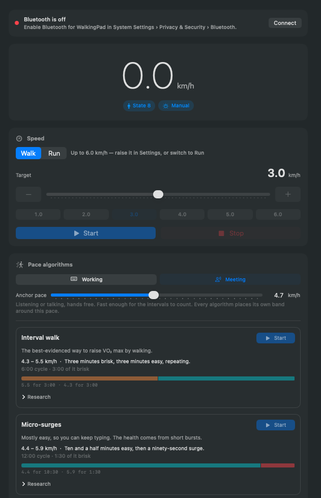
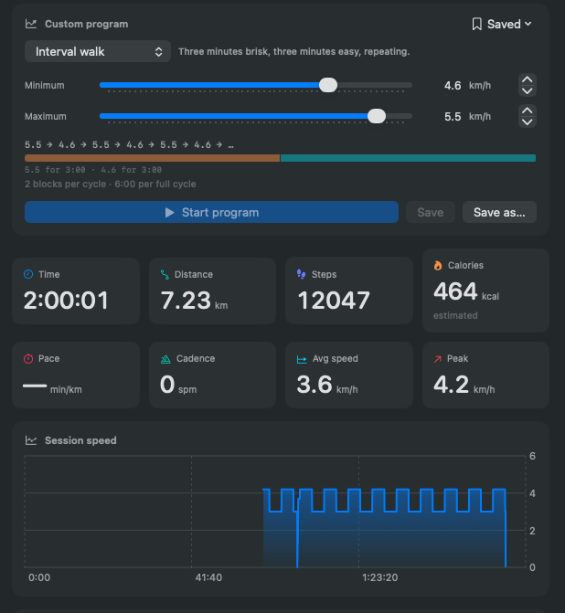

# WalkingPad for macOS

A native macOS app to monitor and control a KingSmith WalkingPad treadmill (R1 Pro, and the
A1/C1/P1 family — they all speak the same Bluetooth protocol) over BLE. No dependencies, no
vendor account, no phone required.


[](LICENSE)

<p align="center">
  
</p>

## What it shows

Everything the belt reports, plus what can be derived from it:

Plus a full walk history: every session saved automatically, with per-day/week/month stats,
charts and CSV export — see [History](#history).

Calorie estimates use your own body data — see [Calories](#calories).

| From the belt | Derived in the app |
| --- | --- |
| Current speed, belt state, mode | Pace (min/km or min/mi) |
| Elapsed time, distance, steps | Cadence (steps per minute) |
| Last app-requested speed | Calories (estimated — the belt reports none) |
| Controller button, raw frames | Average speed, peak speed, session speed chart |
| The belt's own last stored session | |

## What it controls

- Speed, via slider, ±0.5 buttons, or one-tap presets — in 0.1 km/h steps, finer than the
  belt's own remote allows
- **Walk / Run** — Run unlocks the belt's full range up to 10 km/h
- **Research-backed pace algorithms**, one box each — see [Pace algorithms](#pace-algorithms)
- **Working / Meeting mode**, which decides how fast those algorithms may walk you
- A freehand custom program — see [Custom programs](#custom-programs)
- Start / stop, with Space bar as a panic stop and ⌘. as an emergency stop
- Mode: manual, automatic, standby
- Belt-side settings: max speed, start speed, sensitivity, child lock, display units,
  intelligent start, and a distance/calorie/time session target
- A live speed readout in the menu bar — see [Menu bar](#menu-bar)

## Walk and Run

The speed card has a **Walk / Run** switch. Walk caps the slider, presets and programs at your
configured ceiling (6.0 km/h by default) so a stray drag cannot ask for a jog. **Run** lifts that to
10 km/h, the R1 Pro's hardware maximum, and swaps the presets for a running ladder
(2 · 4 · 6 · 7 · 8 · 10).

Switching to Run only unlocks the range — it never changes the belt's current speed, so it cannot
make the belt speed up under you. Switching back to Walk *does* pull anything above the walking
ceiling back down, including a running program, because a lowered limit has to reach the hardware.

10 km/h is the last word regardless of settings: a nonsense or corrupted ceiling falls back to the
belt's minimum rather than upward, since this is a safety limit.

## Menu bar

The live speed sits in the macOS menu bar as a plain number, in place of an icon, so it stays
visible whether the window is focused, minimised, closed, or hidden entirely. Pick what it shows in
Settings › App › **Menu bar shows**:

| Option | Example |
| --- | --- |
| Icon only | 🚶 |
| Speed (default) | `5.0` |
| Speed and distance | `5.0 · 1.24 km` |
| Speed and time | `5.0 · 22:14` |
| Speed and steps | `5.0 · 2841 steps` |

The icon appears only when there is nothing to report — no belt connected, or "Icon only" chosen.
Clicking it gives the speed with its unit, elapsed time, steps, distance, calories, program status,
start/stop, faster/slower, and a way back to the window or the history.

Turn on **Menu bar only (hide Dock icon)** to run it as a pure menu-bar app with no Dock icon and no
app-switcher entry. Enabling it keeps the menu-bar item on, since hiding both would leave a running
app with no icon, no window and no menu to quit from.

### The beep

The belt beeps every time it accepts a command, and that **cannot be turned off from this app**.
Neither reverse-engineered protocol implementation
([ph4r05/ph4-walkingpad](https://github.com/ph4r05/ph4-walkingpad),
[darnfish/walkingpad](https://github.com/darnfish/walkingpad)) exposes a sound, volume or mute
preference — the belt's settable preferences are limited to max speed, start speed, intelligent
start, sensitivity, display, units, child lock and session target — and KingSmith's own app has no
mute either. The beep is firmware-level acknowledgement of a received command, not something the
protocol controls.

Status polling is silent, so an idle connection makes no noise. The only lever from software is how
often the speed changes, so it is worth knowing that the algorithms differ by an order of magnitude
here: **Micro-surges** changes twice every twelve minutes, **Interval walk** twice every six, and
**Gentle drift** every two — 30 beeps an hour against 10 or 5. Beyond that the reported fixes are
physical — damping or removing the panel speaker.

## Pace algorithms

Walking 90 minutes at one unvarying pace is the thing this section exists to replace. Each algorithm
is a **repeating cycle of timed blocks** taken from published research, and each gets its own box
with its own Start button, its band, a to-scale picture of its cycle, and the evidence behind it.

| Algorithm | Cycle | Brisk per cycle | What it is for |
| --- | --- | --- | --- |
| **Interval walk** | 3 min brisk / 3 min easy | 3:00 | The best-evidenced way to raise VO₂ max by walking |
| **Micro-surges** | 10½ min easy / 90 s surge | 1:30 | Mostly easy, so you can keep typing |
| **Three-tier wave** | 3 min easy / 2 steady / 1 brisk | 1:00 | Variety without a long hard block |
| **Long desk session** | 5 intervals, then 30 min easy | 15:00 | For a 90-minute to two-hour walk |
| **Gentle drift** | ±0.1 km/h every 2 min | none | Least distracting; never the same stride twice |

### Working and Meeting mode

The same protocol is worth walking at two different bands. At 3.5–4 km/h you can type accurately; in
a meeting your hands are free and the intervals can actually bite. Pick **Working** or **Meeting**
and set that mode's **anchor pace** — one slider — and every algorithm places its own band around it:

| Algorithm | Working (anchor 3.8) | Meeting (anchor 5.0) |
| --- | --- | --- |
| Interval walk | 3.4 – 4.6 | 4.6 – 5.8 |
| Micro-surges | 3.5 – 5.0 | 4.7 – 6.2 |
| Three-tier wave | 3.4 – 4.7 | 4.6 – 5.9 |
| Long desk session | 3.4 – 4.6 | 4.6 – 5.8 |
| Gentle drift | 3.5 – 4.1 | 4.7 – 5.3 |

Switching mode mid-walk **rebands the running algorithm rather than restarting it**, so a meeting
starting does not reset your session or your accumulated brisk minutes. Nudging the anchor while
walking works the same way, so the band can be found by feel instead of guessed at from a standstill.

Anything above your speed ceiling (6.0 km/h by default) is clamped, and the box tells you which
numbers it will be limited to rather than letting you discover it when nothing happens. Meeting-mode
micro-surges want 6.2 km/h, so that one needs **Run** or a raised ceiling to reach its full band.

### The brisk-minute counter

A running box shows brisk minutes against one researched session's worth. This is the most
actionable number in the literature: the 679-person interval-walking cohort found benefits
**plateauing near 50 minutes of fast walking per week**, so five 3-minute intervals is a full
session — not 90 minutes of them. Only `brisk`/`surge` blocks count, paused time never counts, and a
gap in the belt's status stream is credited at most 5 seconds, so a stalled connection cannot invent
minutes. A gentle drift reports no dose at all: variation is not interval training.

### The research

- **Interval walking training** — Hiroshi Nose and Shizue Masuki, Shinshu University. The 2007
  randomised trial (n=246, mean age 63) found 3-minutes-fast/3-minutes-slow beat continuous walking
  on peak aerobic capacity, leg strength and blood pressure: roughly 9% more aerobic gain, 13–17%
  more knee extension/flexion strength, about 9/5 mmHg off blood pressure. A 679-person cohort saw
  peak aerobic capacity rise ~14%. Karstoft et al. (2013) reproduced the fitness and glycaemic
  effects in type 2 diabetes.
- **Micro-surges** — Emmanuel Stamatakis et al., *Nature Medicine* (2022), on UK Biobank wearable
  data: brief 1–2 minute vigorous bursts inside ordinary movement (VILPA). Three a day tracked with
  ~40% lower cancer mortality and roughly half the cardiovascular mortality.
- **Three-tier wave** — adapted from Gunnarsson and Bangsbo's 10-20-30 concept, *Journal of Applied
  Physiology* (2012). The 3:2:1 shape is kept but stretched to minutes: the belt needs several
  seconds just to change speed, so ten-second blocks cannot be walked here. This is a scaled
  adaptation, not the studied protocol.
- **Gentle drift** — the weakest evidence here, and the app says so in its own box. No trial has
  tested a ±0.3 km/h drift; the reasoning is load rather than fitness, and treadmill-desk practice
  is to nudge the speed rather than hold one number. Cadence research (CADENCE-Adults) puts moderate
  intensity near 100 steps/min, which the Cadence tile shows live.

The dose figures describe *scheduled* intensity, not measured effort — the belt reports no heart
rate. Everything here is general information about published research, not medical advice.

## Custom programs

<p align="center">
  
</p>

The **Custom program** card is for building something the boxes do not cover. Pick a shape, set the
band, and for **Gentle drift** also the step and interval:

| Parameter | Default | Meaning |
| --- | --- | --- |
| Minimum | 4.0 km/h | Bottom of the band, and where a drift starts |
| Maximum | 5.5 km/h | Top of the band |
| Change by | 0.1 km/h | Speed change per step (Gentle drift only) |
| Every | 2:00 | Time between changes (Gentle drift only) |

With the defaults that produces exactly:

```
4.0 → 4.1 → 4.2 → … → 5.4 → 5.5 → 5.4 → 5.3 → … → 4.1 → 4.0 → 4.1 → …
```

Endpoints are visited once per cycle, not twice. A cycle is 30 blocks, one hour at the default
interval. Set `Change by` equal to the whole band and you get a plain two-speed interval instead.

The other shapes carry the block timings the trials used, so `Change by` and `Every` do not apply to
them and are hidden — only the band is yours to set.

**Save** stores the current parameters as that program's defaults; **Save as…** keeps them under a new
name, and the *Saved* menu loads or deletes them. Everything persists across launches.

Rules worth knowing:

- Speeds are held in whole 0.1 km/h units — the belt's native step — so a long program can never
  drift to 5.499999. Programs are always set in km/h even if the app displays miles, because 0.1 mph
  is not representable on this hardware.
- The program is clocked by the belt's own status stream, so it cannot advance while disconnected.
- Pausing the belt pauses the program (after a 10s grace, so spin-up doesn't trip it) and it resumes
  from the same step rather than burning through the schedule while you stand still.
- **Changing speed by hand, or stopping the belt, ends the program.** That is deliberate: otherwise
  the next step would override you, and a Stop press would look ignored.
- Your app speed ceiling always wins. Lower it mid-program and the program is pulled down with it;
  lower it below the whole band and the program stops.

Adding another algorithm means one case in `SpeedProgram.Kind` and one branch in `SpeedSequence.next`.

## History

Every walk is saved automatically — no button to press. The dashboard shows an **All time** row
(total distance, total walk time, average speed, walk count) and **⌘Y** opens the History window:

- Lifetime totals, including the walk currently in progress
- Distance / time / steps / calories charted per **day, week or month**, with the days you did not
  walk shown as gaps rather than closed up
- Averages per active day, week and month, plus how many active periods there were
- Highlights: current day streak, best day, best month, longest walk
- A sortable, selectable table of every walk, with delete and **CSV export**

Sessions are stored as JSON in `~/Library/Application Support/WalkingPad/sessions.json`, written
atomically so an interrupted save cannot truncate your history.

A walk starts when the belt begins moving and ends when the belt's counters reset, when it has been
idle for two minutes, or when the app disconnects or quits. Walks under 30 seconds or 20 steps are
discarded so a nudge of the belt does not become an entry.

One subtlety worth knowing: the belt's counters are **cumulative** and only reset when it sleeps, so
each walk is recorded as a delta against a baseline captured when walking began. Without that, a
second walk on the same belt session would silently re-count the first walk's distance. There is a
check pinning exactly that.

Averages are taken over periods that *had* a walk, not over the whole calendar — "average per day"
answers "on days I walked" rather than being diluted by rest days.

## Quitting, and closing the window

These are different, and the difference matters when a treadmill is involved.

**Closing the window** (red X or ⌘W) changes nothing. The app keeps running in the menu bar, the
speed readout keeps updating, a running program keeps stepping, and the walk keeps recording.

**Quitting** (⌘Q) never stops the belt by itself — a remote going away does not change what the
machine is doing. Settings › App › **When quitting** decides what happens when the belt is actually
running:

| Option | Behaviour |
| --- | --- |
| Ask me (default) | Confirms, showing the current speed: *Stop Belt and Quit* / *Leave Running* / *Cancel* |
| Leave the belt running | Quits silently, belt keeps going |
| Stop the belt | Sends a stop and waits for the belt to confirm before quitting |

Stopping waits up to 6 seconds — enough for the command queue's spacing plus the belt's ramp down —
and then quits regardless. A quit must never hang on hardware.

Either way, quitting ends any running **program**, so the belt holds its last speed rather than
continuing to change. The prompt says so when a program is active. The walk in progress is always
saved first.

None of this applies when the belt is already stopped or not connected: the quit is immediate, with
no prompt.

## Calories

The belt reports no calories at all, so the app estimates them from your body data in
Settings › App › **Body data**. Every field can be typed directly or stepped:

Find it under Settings (**⌘,**) › **Calories**.

| Field | Affects |
| --- | --- |
| Weight (kg or lb) | The walking cost itself — this is the number that matters most |
| Height | The walking cost, via the ACSM equation |
| Age, Sex | Only the resting-metabolism baseline, so only the net figure |

**Gross vs net.** Gross counts everything burned while walking, including what you would have burned
sitting still. Net subtracts resting metabolism (Mifflin-St Jeor) and is the extra the walk actually
cost you — the honest number to compare against food. Toggle **Show net calories** to switch; every
display follows it, and the tile says which one you are looking at.

The stored figure is always gross, integrated against the belt's own clock while you walk, so
switching to net never loses data — it is derived on the fly.

**Correcting your weight later.** Stored calories were computed against whatever body data was set at
the time, so fixing your weight afterwards would otherwise only affect future walks. **Recalculate
calories** in the same settings section recomputes every recorded walk from its duration and average
speed using your current body data, and tells you how many changed.

These are estimates from a published formula, not measurements. Treat them as indicative.

## Build and run

Requires only the Xcode Command Line Tools (`xcode-select --install`). Full Xcode is optional.

```bash
./build.sh --run
```

That verifies the protocol layer, compiles, generates the icon, assembles and ad-hoc signs
`dist/WalkingPad.app`, and launches it.

```bash
./build.sh              # just build
./build.sh --install    # build and copy to /Applications
UNIVERSAL=1 ./build.sh  # universal arm64 + x86_64 binary
```

**First launch:** macOS asks for Bluetooth permission. Allow it, or the app cannot see the belt.
Because the app is ad-hoc signed, its signature changes on every rebuild, so macOS may ask
again after you rebuild. Grant it under System Settings › Privacy & Security › Bluetooth.

Turn the belt on and put it in standby (not off) before connecting. The app scans for the
WalkingPad BLE service, and falls back to matching on device name after a few seconds.

## Troubleshooting with padctl

`dist/padctl` is a CLI for when the GUI cannot find the belt:

```bash
./dist/padctl selftest      # verify the protocol layer, no hardware needed
./dist/padctl watch         # connect and stream live status frames
./dist/padctl speed 3.0     # start the belt at 3.0 km/h
./dist/padctl stop          # stop the belt
```

`selftest` runs anywhere. The hardware commands need Bluetooth permission, which macOS grants
to the *terminal app you run them from* — so run them from Terminal or iTerm and allow the
prompt. They will not work from a non-interactive shell (a script, a CI job, an agent), because
there is no app for macOS to attribute the permission to; the process is killed on the spot.

For the same reason `padctl` ships as `dist/padctl.app` with a thin `dist/padctl` wrapper:
macOS refuses Bluetooth to a bare executable even when the usage description is linked into its
`__TEXT,__info_plist` section, so the tool has to be the main executable of a real bundle.

## How it works

The belt exposes a BLE service `FE00` with notify `FE01` and write `FE02`. Frames are
`F7 <cmd> <payload…> <crc> FD`, where the CRC is the low byte of the sum of everything
between the header and the CRC.

| Command | Frame |
| --- | --- |
| Ask for status | `F7 A2 00 00 A2 FD` |
| Set speed (0.1 km/h units) | `F7 A2 01 <speed> <crc> FD` |
| Set mode (0 auto, 1 manual, 2 standby) | `F7 A2 02 <mode> <crc> FD` |
| Start belt | `F7 A2 04 01 A7 FD` |
| Ask for stored session | `F7 A7 AA FF 50 FD` |
| Set preference | `F7 A6 <key> <type> <b2 b1 b0> <crc> FD` |

Status frames arrive as `F8 A2 …`: belt state at byte 2, speed×10 at byte 3, mode at byte 4,
then big-endian 24-bit elapsed seconds, distance in 10 m units, and steps. The parser is
verified against a real captured frame in `padctl selftest`.

Two behaviours worth knowing, both handled by the app:

- **The belt ignores commands sent less than ~0.7 s apart.** All writes go through a spaced,
  coalescing queue; dragging the slider commits once on release rather than spamming writes.
- **Speed changes only apply in manual mode on a running belt.** Setting a speed while stopped
  transparently sends mode → start → speed.

## Layout

```
Sources/WalkingPadKit/   protocol, BLE controller, metrics  (no UI, headlessly testable)
Sources/WalkingPad/      SwiftUI app
Sources/padctl/          CLI diagnostics + protocol self-test
Support/                 Info.plist for the app and the CLI
tools/MakeIcon.swift     draws AppIcon.icns
docs/adr/                architecture decision records
```

There is no test target: this toolchain's SDK ships neither XCTest nor swift-testing, so the
protocol assertions are compiled into `padctl selftest`, which `build.sh` runs on every build.
See [ADR 0001](docs/adr/0001-macos-app-architecture.md).

## Safety

This app drives a motorised treadmill. The in-app speed slider is capped by a configurable
ceiling (default 6.0 km/h, hard limit 10.0 km/h). Space bar always stops the belt. Don't set a
speed you are not ready to walk at, and keep the belt's own remote within reach.

## Credit

The BLE protocol was reverse engineered by
[ph4r05/ph4-walkingpad](https://github.com/ph4r05/ph4-walkingpad); this app is an independent
native Swift implementation of it. Not affiliated with KingSmith.

## License

MIT. Free to use, copy, modify, and distribute. This software drives a motorised treadmill —
use it at your own risk, with no warranty of any kind. See [LICENSE](LICENSE).
